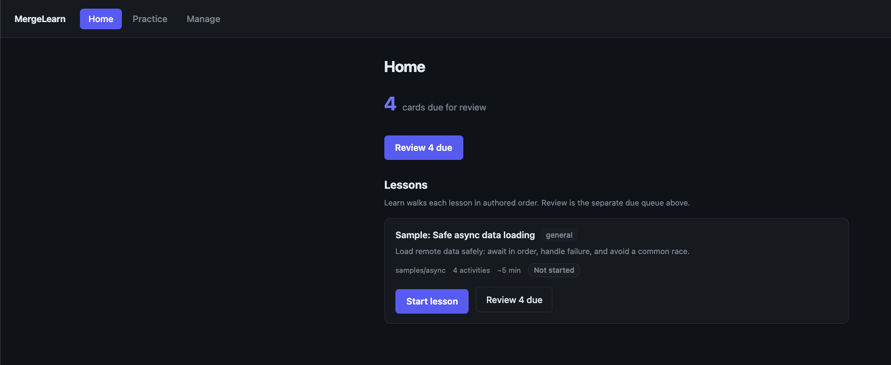
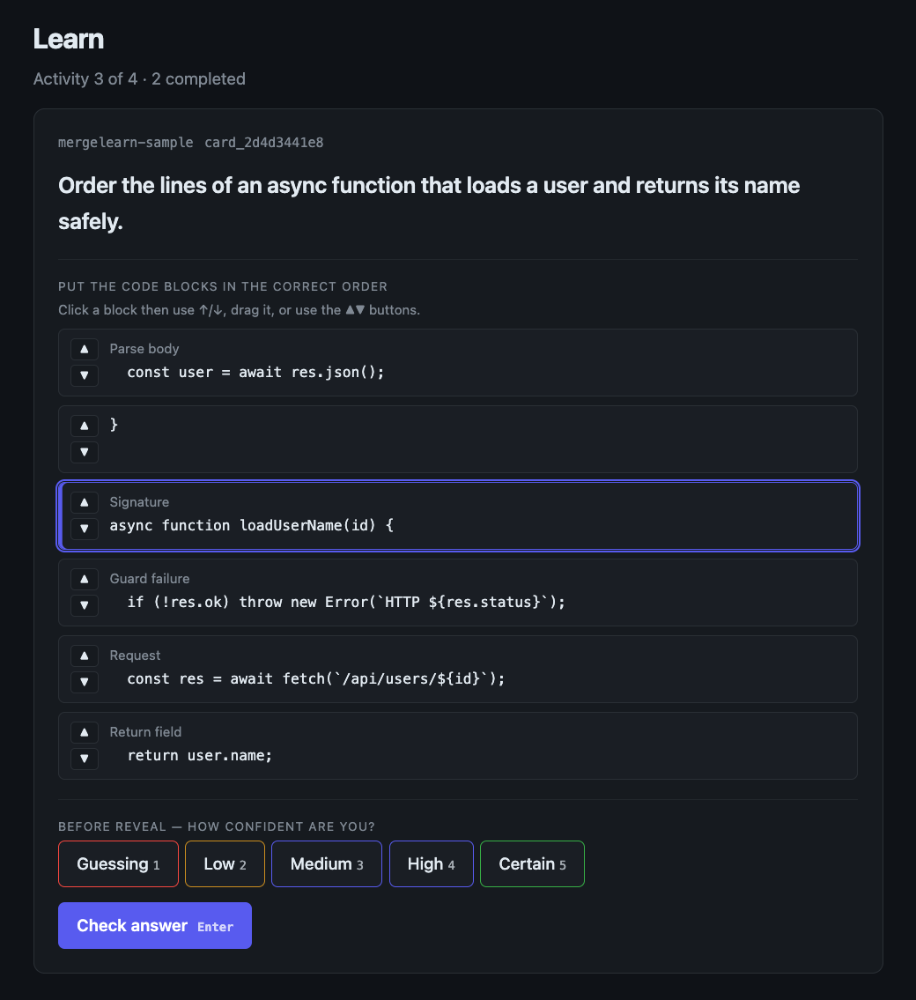
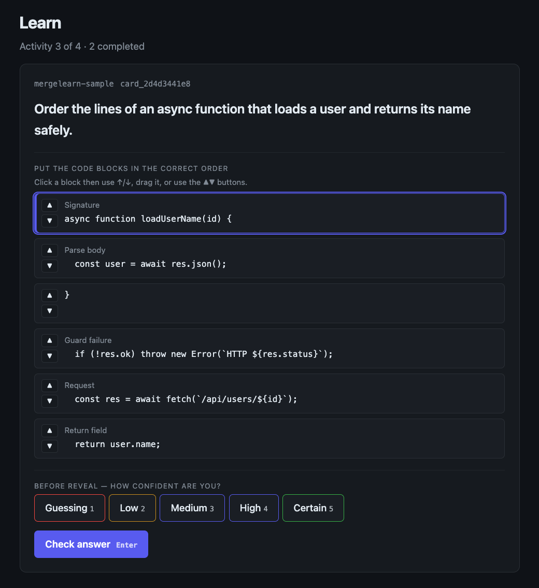
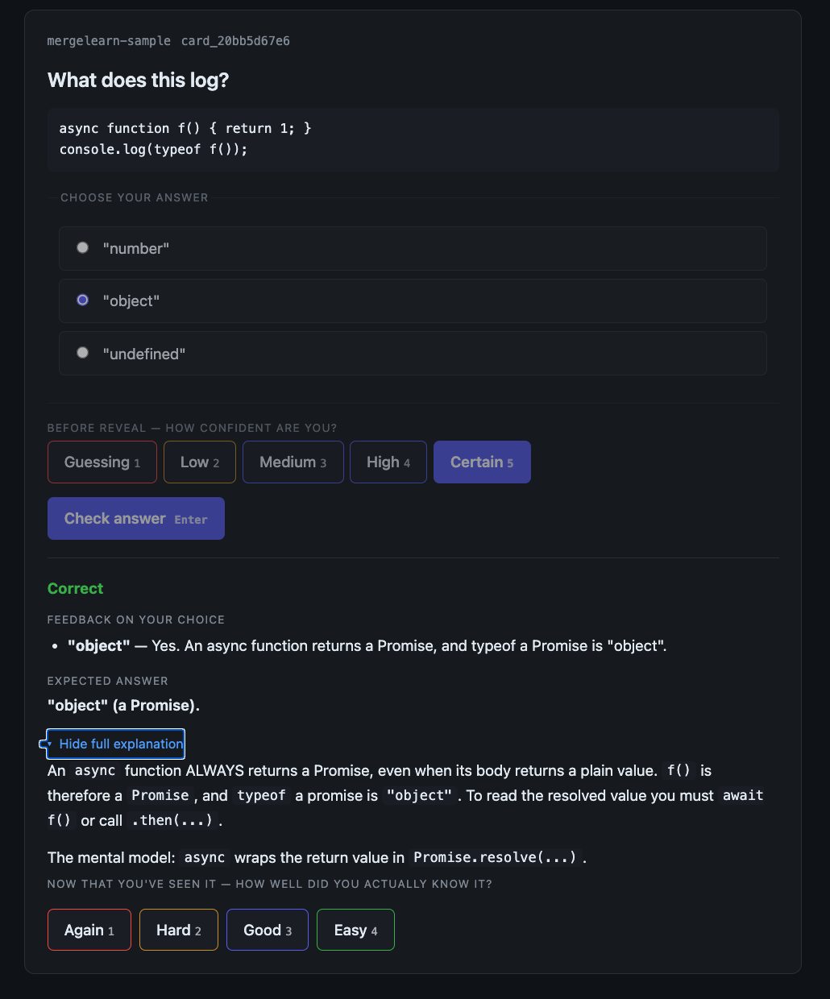

# MergeLearn

MergeLearn is a local-first, model-free learning tool. Your own coding agent
writes the lessons; MergeLearn stores them, schedules reviews with FSRS, and
gives you a local website to learn from. It ships no model and makes no network
calls.

## How you use it

```bash
npm install -g mergelearn
mergelearn setup-agent
```

Then open your coding agent in a repository and ask:

> Create a MergeLearn lesson from my last PR.

The agent runs the authoring commands for you. When it says the lesson is ready:

```bash
mergelearn serve            # prints a local URL like http://127.0.0.1:52134
mergelearn serve --port 4321  # or pin a fixed port
```

Open the printed URL and learn in your browser. This is the primary day-to-day
interface. Home lists lessons with their objective, estimated time, progress,
and one Start / Continue / Practice again action. Due spaced-repetition reviews
stay in a separate banner.

<p align="center">
  
</p>

*Home keeps authored lessons and spaced-repetition reviews separate.*

### Try it before using an agent

From the empty Home page, click **Try a sample lesson**, or run:

```bash
mergelearn sample
mergelearn serve
```

The sample is opt-in, offline, and demonstrates every question type. Running the
command again does not create duplicates.

## Install details

Requirements: Node.js 20 or newer. Git is needed only for lessons that cite
repository code.

`setup-agent` auto-detects installed coding agents. Supported agents: `claude`
(Claude Code), `codex`, `cursor`, `opencode`, and `gemini`.

```bash
mergelearn setup-agent                                  # detected agents, global
mergelearn setup-agent --agent all                      # every supported agent
mergelearn setup-agent --agent claude,codex --scope project
mergelearn setup-agent --dry-run                        # preview, write nothing
mergelearn setup-agent --uninstall                      # remove managed copies
mergelearn doctor                                       # read-only setup diagnosis
```

The installer copies the canonical skills (no symlinks), records checksums so
reruns are idempotent, and never overwrites a copy edited by hand. Unsupported
agents can read `skills/mergelearn-authoring/SKILL.md` directly.

## Question types

Cards are attempt-first: you act before the answer is revealed, and the reveal
is feedback on your attempt.

- **Multiple choice.** Pick one or several options, graded in the browser.
- **Text answer.** Write a short answer, then self-grade against the expected
  one. Good for explain-why prompts.
- **Code ordering.** Reorder shuffled code blocks into the correct sequence
  (click a block and use the arrow keys, drag it, or use the move buttons),
  graded by exact order.
- **Flashcard.** A plain reveal-then-self-grade card for pure recall.

Code-ordering activities work with the mouse or keyboard. Select a tile, move it
with the arrow keys or visible buttons, or drag it into place.

<table>
  <tr>
    <td width="50%"></td>
    <td width="50%"></td>
  </tr>
  <tr>
    <td><em>Select a code tile.</em></td>
    <td><em>Move it without losing selection.</em></td>
  </tr>
</table>

After an attempt, MergeLearn reveals deterministic feedback and the authored
explanation. Your confidence grade controls FSRS scheduling; answer correctness
is stored as evidence but does not grade your confidence for you.

<p align="center">
  
</p>

*Feedback appears only after the attempt; the learner still chooses the review grade.*

## Ways to use it

- **Learn a codebase.** Ask your agent to author lessons from real files; cited
  code is frozen at a pinned commit so the lesson stays stable.
- **Learn a concept.** Skip the repo and ask for a conceptual lesson on any
  topic (a language feature, an algorithm, a protocol).
- **Keep it fresh.** Review the due queue in the browser now and then; FSRS
  spaces cards so you revisit them right before you would forget.
- **Preview before you trust it.** Run `mergelearn import --dry-run` on an
  agent's output to see what would be created before it touches your library.

## CLI commands

The browser is the main interface, but every action is also available on the
command line.

```bash
mergelearn context     [--goal "..."] [--repo <path>] [--target-set <id>]
mergelearn import      --file <patch.json> [--agent <name>] [--dry-run] [--json]
mergelearn sample      [--dry-run]
mergelearn doctor      [--json]
mergelearn sets
mergelearn due         [--set <id>] [--tag <id>] [--folder <path>]
mergelearn show        --set <id> --card <id>
mergelearn grade       --card <id> --rating <1-4>
mergelearn serve       [--port <n>]
mergelearn setup-agent [--agent <ids|all>] [--scope global|project] [--dry-run] [--uninstall]
```

`context` prints the current library state for an agent; `--goal` is optional but
helps focus the lesson. `import` validates the patch, freezes cited code, and
prints the lesson objective, duration, interaction mix, source coverage, and
advisory warnings. `import --dry-run` writes nothing; `--json` is for agents and
automation.

## Storage layout

The library lives at `~/.mergelearn/` (override with `MERGELEARN_HOME` or
`--home`).

```
~/.mergelearn/
  library/
    tags.json                     the taxonomy that links topics together
    folders.json
    sets/<setId>/
      set.json
      order.json                  the teaching order
      cards/<cardId>.json         one file per card
  repos/registry.json             stable repoId -> path (optional)
  profile/sessions/<date>/        one file per review sitting
agent-skills.json                 manifest of skills installed via setup-agent
```

## Privacy

- No telemetry, no required network calls, no bundled model.
- Your coding agent does the authoring; MergeLearn never sends code anywhere.
- Cited code is read from your local disk and frozen at a pinned commit.

See `docs/PRIVACY.md` for details.

## Verification

```bash
npm run check          # tsc --noEmit
npm test               # vitest
npm run build          # emit dist/
npm run smoke          # build + CLI --help
npm run smoke:package  # pack the tarball and run the packaged binary
```

## License

Licensed under the PolyForm Noncommercial License 1.0.0. See [LICENSE](./LICENSE).
Noncommercial use is allowed under the public license; commercial use requires
separate permission from the copyright holder, Odra Labs. This is a
source-available license, not an OSI-approved open-source license.
