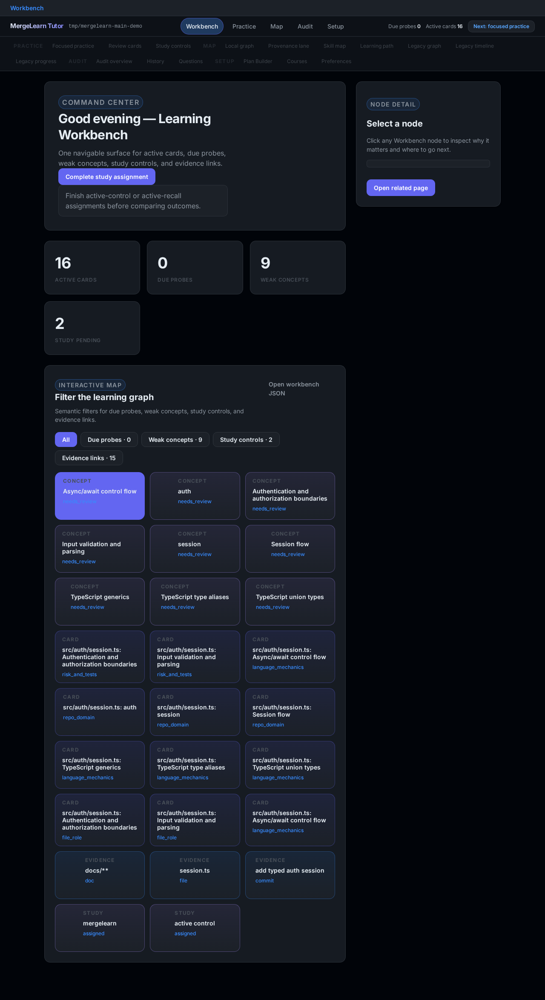
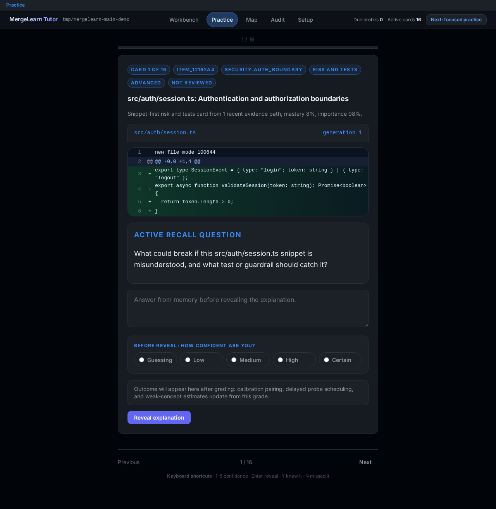
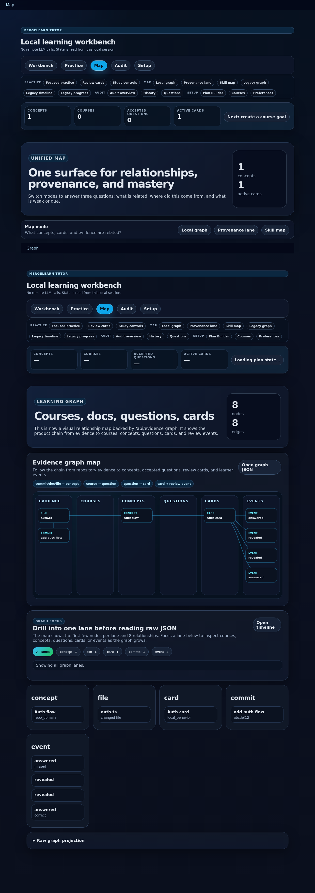
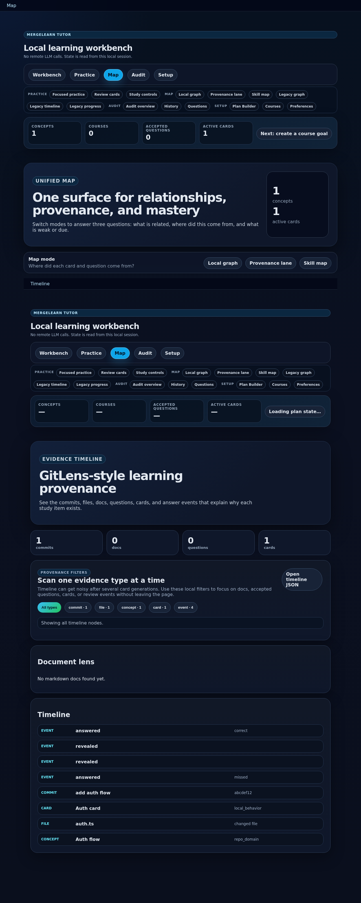
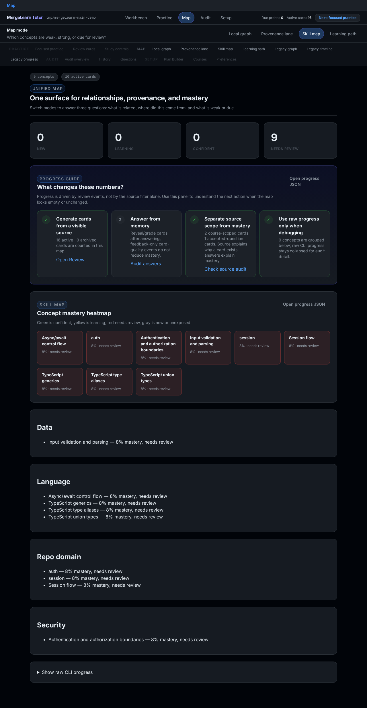
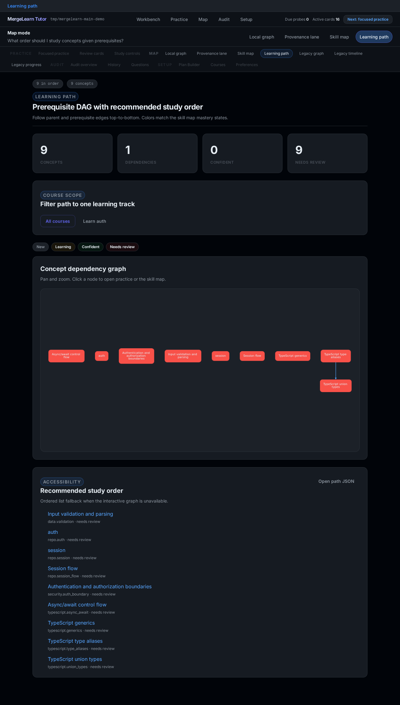
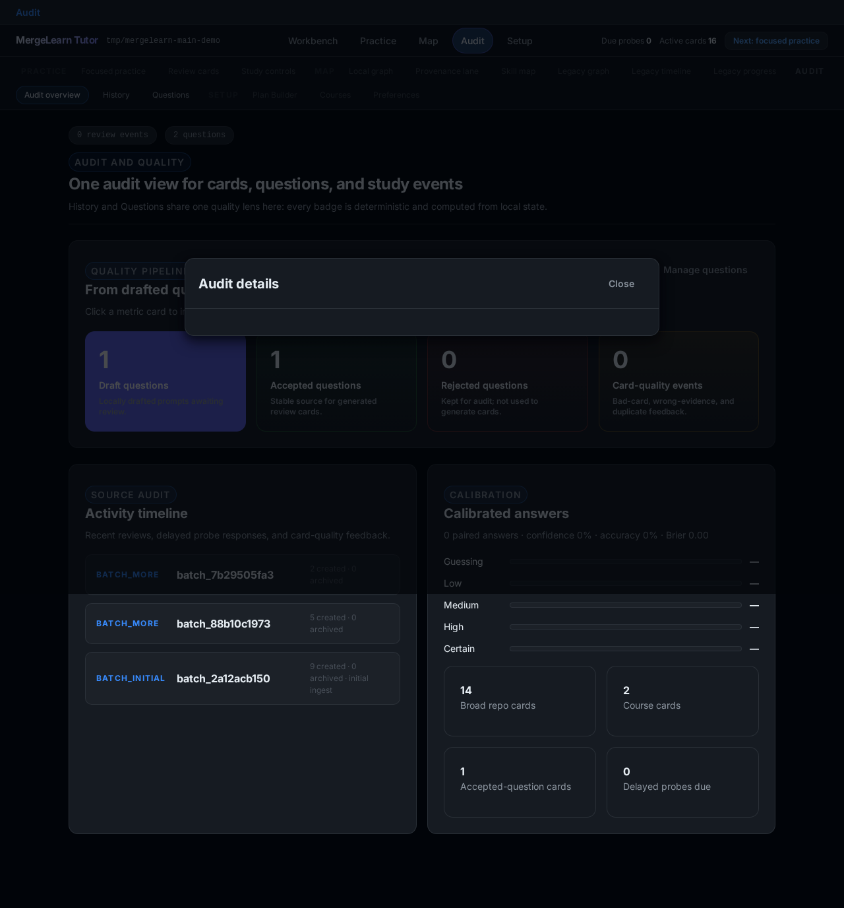
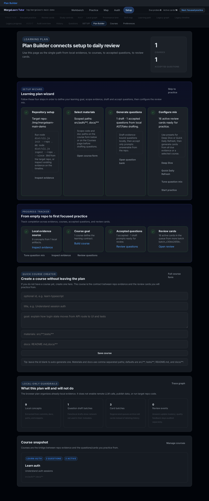

# MergeLearn Tutor

MergeLearn Tutor is a local-first code learning tool for developers who use AI heavily but still want to understand the code they ship. It reads git history, extracts repo-specific concepts, and turns real diffs, files, docs, and commits into short active-recall cards.

It is not a SaaS dashboard, PR blocker, or remote AI code reviewer. It is a personal knowledge-debt tool that runs locally, keeps state in your repository, and makes the evidence behind every question inspectable.



## What it does

- Ingests git history and changed files from a local repository.
- Detects concepts using deterministic rules, repo lexicons, and TypeScript AST analysis.
- Creates snippet-first learning cards tied to real files, commits, and docs.
- Supports active recall: answer first, reveal explanation, then self-grade.
- Preserves card history when you regenerate a queue.
- Lets you create courses with goals, material paths, doc paths, and preferred question types.
- Drafts fake/local LLM-style questions without network access, then lets you accept or reject them.
- Shows a unified Map surface with local graph, provenance, and skill map modes.
- Stores all local state in `.skilltrace/` so you can inspect or delete it at any time.

## Privacy stance

MergeLearn Tutor is local-first by default.

- No telemetry.
- No target repo code execution.
- No required LLM calls.
- No remote question drafting.
- Optional fake/local enrichment sends no network requests.
- Remote providers are intentionally rejected until a human explicitly approves privacy behavior.

Before any future enrichment, inspect what would leave your machine:

```bash
mergelearn-tutor privacy preview --repo . --provider fake --include-snippets
```

## Requirements

- Node.js 20 or newer.
- npm.
- Git available on `PATH`.

## Install for local development

```bash
npm install
npm run build
```

Optional local command:

```bash
npm link
mergelearn-tutor --help
```

You can also run the built CLI directly:

```bash
node dist/cli.js --help
```

## Quick start

Run these commands from the MergeLearn Tutor repository, pointing `--repo` at the codebase you want to learn from:

```bash
npm run build
node dist/cli.js init --repo /path/to/your/repo
node dist/cli.js ingest --repo /path/to/your/repo --since 30d
node dist/cli.js cards generate --repo /path/to/your/repo --count 5 --mode more
node dist/cli.js session --repo /path/to/your/repo
```

The session command prints a local URL. Open it in your browser to start focused practice, inspect the map, audit quality, and manage your learning plan.

## Browser surfaces

The browser session is organized into five primary surfaces. Each primary surface has secondary pages for legacy and advanced workflows.

### Workbench

Command center: interactive map of local learning nodes with semantic filters (due, weak, study, evidence) and a detail drawer.


### Practice

Focused one-card retrieval-practice loop. One card at a time: answer from memory, rate confidence, reveal, self-grade. Keyboard shortcuts: 1-5 confidence, Enter reveal, Y knew it, N missed it.



### Map

Unified surface with three modes for inspecting relationships, provenance, and mastery:

| Local graph | Provenance lane | Skill map |
|---|---|---|
|  |  |  |

Legacy graph, timeline, and progress pages are available as secondary navigation links.

**Learning path** (Map subnav): prerequisite DAG over concepts with recommended study order and mastery-colored nodes. Open `/learning-path` or `/path`.



### Audit

Consolidated quality view combining card history and question bank. All badges are deterministic and computed from local state.



### Setup

Guided learning plan wizard with inline course creation. The Plan Builder walks you from empty repo to first focused practice in one page.



## Legacy pages

All original pages remain accessible from secondary navigation:

| Review | Courses |
|---|---|
|  |  |

| Questions | Timeline |
|---|---|
|  |  |

| Graph | History |
|---|---|
|  |  |

| Progress | Preferences |
|---|---|
|  |  |

Read the full page-by-page guide in `docs/USER_MANUAL.md`.

## Example: create a course and question bank

```bash
mergelearn-tutor course create \
  --repo . \
  --id learn-auth \
  --title "Learn auth" \
  --goal "Understand auth from source, tests, and docs" \
  --materials "src/**,tests/**" \
  --docs "docs/**"

mergelearn-tutor questions draft --repo . --course learn-auth --provider fake --count 5
mergelearn-tutor questions list --repo . --course learn-auth
mergelearn-tutor questions accept --repo . --id <question-id>
mergelearn-tutor cards generate --repo . --course learn-auth --count 5
```

Accepted questions can drive future course cards. Drafting with `--provider fake` is deterministic and does not call a remote model.

## Core CLI commands

```bash
mergelearn-tutor init --repo .
mergelearn-tutor ingest --repo . --since 30d --limit 80
mergelearn-tutor today --repo .
mergelearn-tutor review --repo . --count 5
mergelearn-tutor cards generate --repo . --count 5 --mode more
mergelearn-tutor cards generate --repo . --count 5 --mode regenerate
mergelearn-tutor answer --repo . --item <id> --answer "..." --correct
mergelearn-tutor feedback --repo . --item <id> --event revealed --confidence 4
mergelearn-tutor delayed list --repo .
mergelearn-tutor delayed complete --repo . --probe <probe-id> --answer "..." --correct
mergelearn-tutor study assign --repo . --seed local-pilot --count 6
mergelearn-tutor study list --repo .
mergelearn-tutor study passive-complete --repo . --assignment <assignment-id> --duration-ms 120000
mergelearn-tutor feedback --repo . --item <id> --event marked_bad_card --note "wrong evidence"
mergelearn-tutor correct --repo . --concept <concept-id> --type better_label --label "session authorization"
mergelearn-tutor course create --repo . --id <id> --title "..." --goal "..." --materials "src/**" --docs "docs/**"
mergelearn-tutor questions draft --repo . --course <id> --provider fake --count 5
mergelearn-tutor questions accept --repo . --id <question-id>
mergelearn-tutor timeline --repo .
mergelearn-tutor progress --repo .
mergelearn-tutor dashboard --repo .
mergelearn-tutor session --repo .
```

## Verification

Run the standard local checks before pushing:

```bash
npm run check
npm test
npm run build
npm run eval
npm run smoke
npm run smoke:package
```

For a full fixture evaluation:

```bash
npm run eval:repos -- --fixtures --with-enrichment fake --out /tmp/mergelearn-tutor-fixtures
```

## Documentation

- `docs/USER_MANUAL.md` — page-by-page browser and CLI manual.
- `docs/REVIEW_SESSION.md` — local browser session and API details.
- `docs/CUSTOMIZATION.md` — preferences, API surface, and question settings.
- `docs/PRIVACY.md` — local-first privacy model and outbound preview.
- `docs/LEXICON.md` — repo-specific concept packs, aliases, and ignores.
- `docs/ANALYZERS.md` — deterministic extraction and TypeScript AST analyzer.
- `docs/CARD_QUALITY.md` — card quality rules and dogfood notes.
- `docs/EVALUATION.md` — evaluation harness and quality rubric.
- `docs/ROADMAP.md` — current roadmap.

## Release status

This repository is ready for a local GitHub push after verification, but it is not ready for public npm publishing yet.

Current release blockers:

- The package is still `private: true`.
- The package license is still `UNLICENSED`.
- There is no public `LICENSE` file yet.
- Product name, license, and distribution channel need explicit human approval before public release.

See `docs/GITHUB_PUSH_READY.md` for the final push checklist.