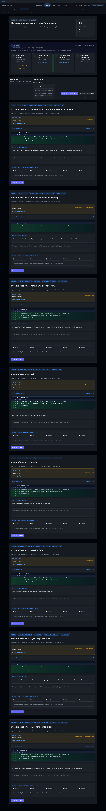
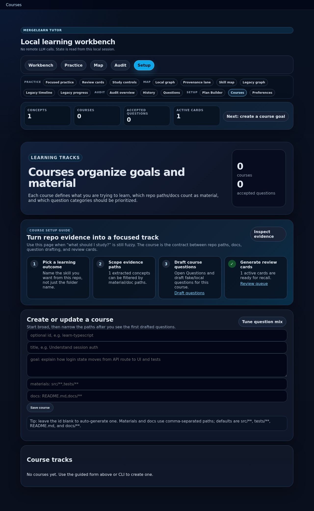
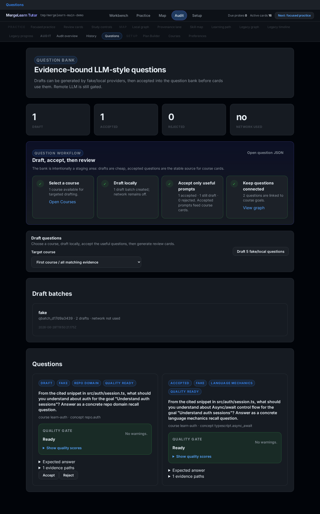
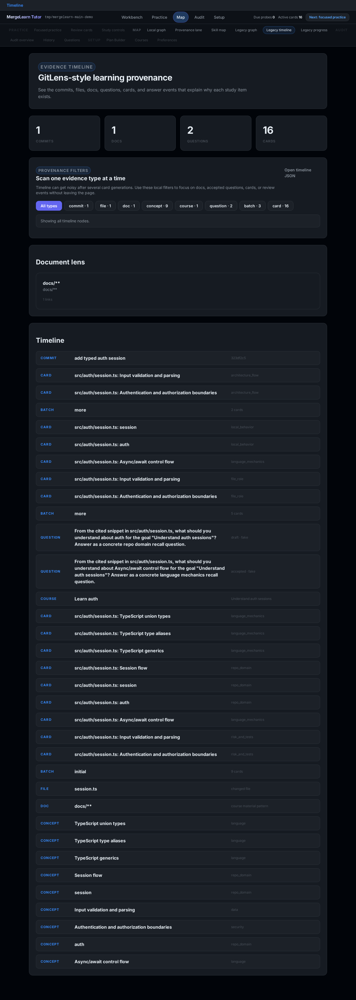
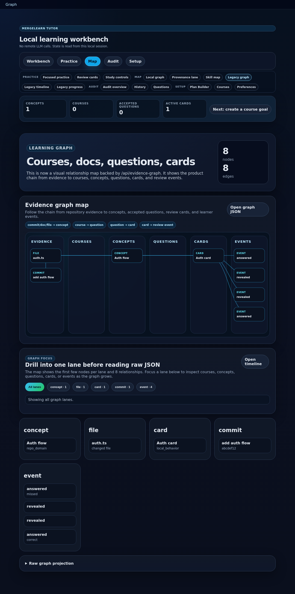
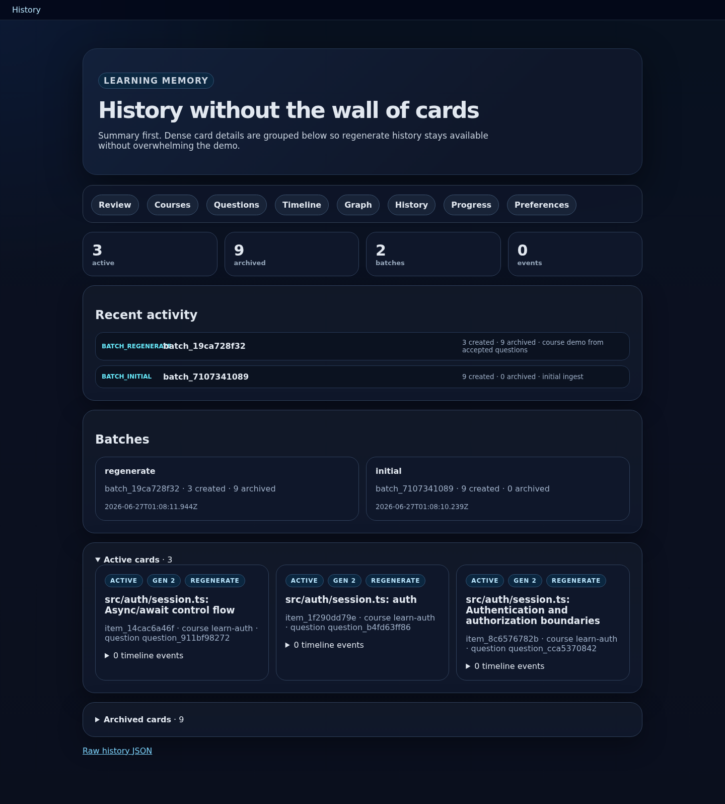
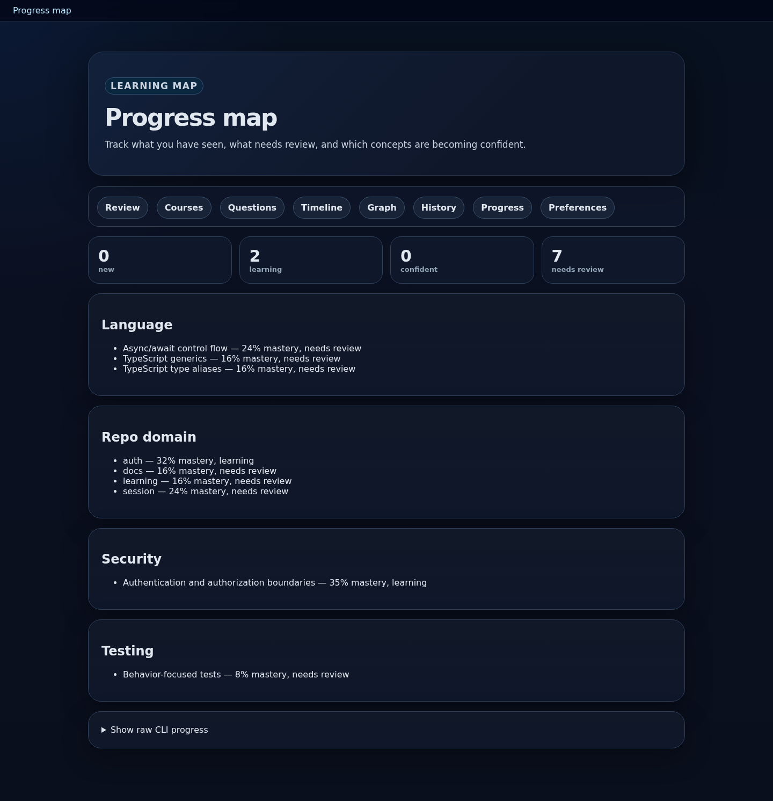
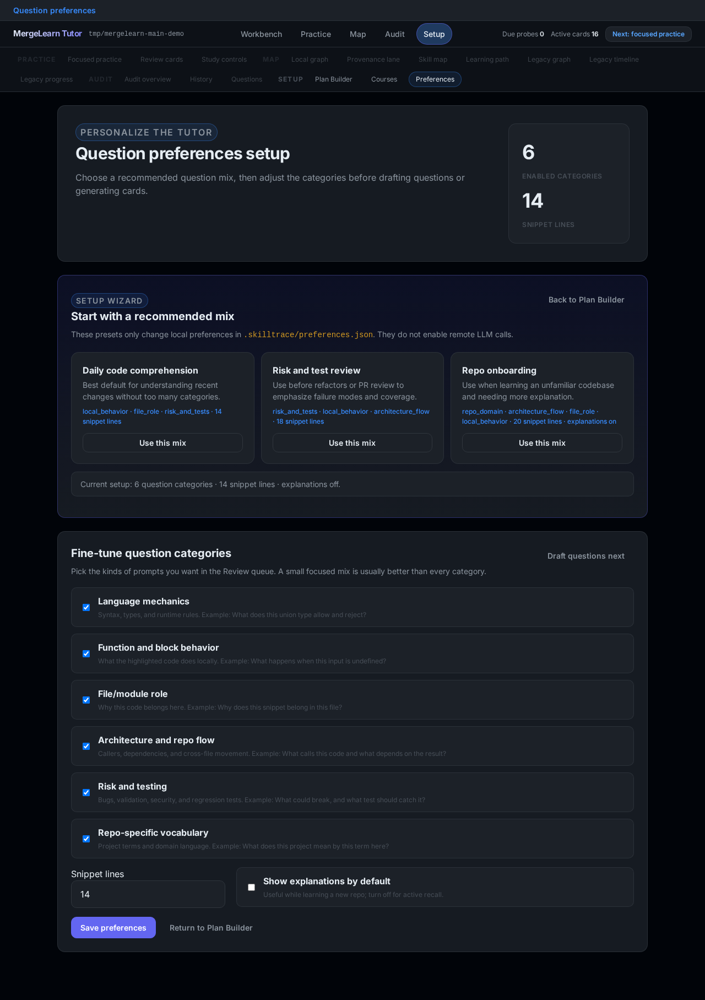

# MergeLearn Tutor User Manual

This manual explains how to use MergeLearn Tutor from setup through daily review. It is written for a developer who wants a local tool that turns recent repository work into grounded learning material.

## 1. Mental model

MergeLearn Tutor builds a local learning loop:

1. Ingest git history and changed files.
2. Extract concepts from code, docs, tests, and path names.
3. Generate evidence-linked learning cards.
4. Review cards from memory.
5. Preserve answers, feedback, archived cards, courses, question drafts, and graph data in `.skilltrace/state.json`.

The tool is intentionally local-first. It does not run target repo code or call remote LLMs by default.

## 2. First run

From the MergeLearn Tutor repo:

```bash
npm install
npm run build
node dist/cli.js init --repo /path/to/your/repo
node dist/cli.js ingest --repo /path/to/your/repo --since 30d
node dist/cli.js cards generate --repo /path/to/your/repo --count 5 --mode more
node dist/cli.js session --repo /path/to/your/repo
```

Open the printed local URL in your browser.

The Review page also includes a `Start here` panel. Use it as the browser checklist from an empty repo to a useful learning queue:

1. Ingest repo evidence so concepts are extracted from recent commits and docs.
2. Create a course goal that names the material and docs you care about.
3. Draft fake/local questions and accept the useful ones.
4. Generate cards and review them from memory.

The checklist is state-aware: completed steps show current counts, while incomplete steps point to the next local CLI command or browser page.

The `Plan Builder` page is the consolidated browser view for that same path. Open it when you want one place to answer: what evidence exists locally, which course goal is active, whether accepted questions are ready, and what the next review action should be. It also repeats the local-only guardrails: the plan view does not enable remote LLM calls, publish data, or run target repo code.

Every browser page includes the shared app shell at the top. Use it to jump between Review, Plan Builder, Courses, Questions, Timeline, Graph, History, Progress, and Preferences, and to check the current local plan snapshot: concept count, course count, accepted-question count, active-card count, and the next recommended action. The snapshot is read from the local `/api/state` endpoint in the running session; it does not make remote calls.

## 3. Review page



Use the Review page for daily active recall.

What you see:

- active cards generated from recent repo evidence
- a real code or diff snippet
- the question plane, such as `risk_and_tests` or `repo_domain`
- an answer box
- a reveal button
- self-grade and card-quality feedback controls

How to use it:

1. Read the snippet.
2. Answer from memory before revealing anything.
3. Click `Reveal explanation`.
4. Choose `I knew it`, `Partly`, or `Missed it`.
5. Use `Bad card` or `Wrong evidence` when the tutor is wrong. These quality flags do not count as learner failure.

Queue controls:

- `Review source` lets you keep the default broad queue (`All due repo evidence`) or target a specific course.
- When a course is selected, generation uses that course's scoped evidence and accepted questions where they match.
- `Generate 5 focused cards` adds cards without deleting the current queue.
- `Regenerate from source` archives the current active queue and creates a new focused queue from the selected source.

Archived cards stay in history.

## 4. Courses page



Use Courses to define what you are trying to learn.

The browser page now starts with a `Course setup guide`. Use it to move from a fuzzy topic to a focused learning track:

1. Pick a concrete learning outcome.
2. Scope material and docs paths.
3. Draft course questions.
4. Generate course-specific review cards.

The course form includes examples and safe defaults. Leave the id blank if you want MergeLearn Tutor to generate one from the title.

A course contains:

- course id
- title
- learning goal
- source material paths, such as `src/**` and `tests/**`
- documentation paths, such as `README.md` or `docs/**`
- enabled question planes
- focused concept ids

Create a course in the browser or CLI:

```bash
mergelearn-tutor course create \
  --repo . \
  --id learn-auth \
  --title "Learn auth" \
  --goal "Understand auth from source, tests, and docs" \
  --materials "src/**,tests/**" \
  --docs "docs/**"
```

Use Courses when you want the tutor to connect material, goals, and accepted questions instead of only reviewing the latest commits.

## 5. Questions page



Use Questions to manage the question bank.

The `Question workflow` panel explains the staging model: draft locally, accept only useful prompts, and then let accepted questions feed review cards. If at least one course exists, choose the target course from the `Target course` selector before drafting in the browser.

What this page shows:

- draft questions
- accepted questions
- rejected questions
- provider metadata
- evidence paths
- expected answers hidden behind details
- whether network access was used

Draft questions locally:

```bash
mergelearn-tutor questions draft --repo . --course learn-auth --provider fake --count 5
```

Then review and accept useful drafts:

```bash
mergelearn-tutor questions list --repo . --course learn-auth
mergelearn-tutor questions accept --repo . --id <question-id>
```

Important: `fake` and `local` providers are no-network. Remote LLM question drafting is intentionally not enabled yet.

## 6. Timeline page



Use Timeline to inspect provenance.

The timeline answers:

- Which commits introduced learning evidence?
- Which source files and docs were touched?
- Which concepts were extracted?
- Which questions and cards came from that evidence?
- Which review events happened later?

The Document Lens highlights markdown and documentation material. This is how docs become first-class learning material rather than being hidden behind code diffs.

Use `Provenance filters` when the timeline gets noisy. The filter chips hide unrelated rows locally so you can scan only docs, concepts, questions, cards, or review events before opening the raw JSON.

CLI equivalent:

```bash
mergelearn-tutor timeline --repo .
```

## 7. Graph page



Use Graph to inspect the local learning graph.

The graph groups nodes by type:

- commits
- files
- docs
- concepts
- courses
- question drafts
- card batches
- cards
- review events

The `Graph focus` panel gives a small drill-down mode before you open raw JSON: choose a node type/lane to hide unrelated grouped columns, then switch back to `All lanes` when you want the full map context.

The `Raw graph projection` panel exposes the underlying nodes and edges. This keeps the UI simple while making the data model transparent and ready for a future richer graph renderer.

API endpoint:

```text
/api/evidence-graph
```

## 8. History page



Use History to audit what happened without reading every card at once.

The page is summary-first:

- active cards
- archived cards
- batches
- review events
- recent activity
- active card details
- archived card details collapsed by default

Use this page when you want to confirm that regeneration preserved old cards and events.

The `Source audit` panel explains why cards exist before you inspect individual cards:

- `All due repo evidence cards` came from the broad Review source.
- `Course-scoped cards` came from a selected course and should show a course id.
- `Accepted-question cards` came from approved question-bank prompts.
- `Card-quality events` are audited separately from mastery, so bad-card/wrong-evidence feedback does not count as a missed answer.

API endpoint:

```text
/api/cards/history
```

## 9. Progress page



Use Progress to inspect concept mastery.

The page groups concepts by type and shows review status. It is not the main habit loop; it is an inspection page for understanding what the tutor thinks you are learning.

The `Progress guide` explains what changes the numbers when the map is empty or unchanged:

- generating cards creates source-visible study items;
- answered review events update mastery;
- course/question source scope explains why a card exists, not whether you know it;
- raw CLI progress stays collapsed for debugging and audits.

CLI equivalent:

```bash
mergelearn-tutor progress --repo .
```

## 10. Preferences page



Use Preferences to choose question types.

Question planes:

- `language_mechanics` — syntax, types, runtime behavior
- `local_behavior` — what a function or block does
- `file_role` — why code belongs in a file
- `architecture_flow` — how code connects across files
- `risk_and_tests` — bugs, validation, security, regression tests
- `repo_domain` — project-specific vocabulary

Preferences are saved locally in `.skilltrace/preferences.json`.

CLI equivalent:

```bash
mergelearn-tutor preferences show --repo .
mergelearn-tutor preferences set --repo . --planes local_behavior,risk_and_tests --snippet-lines 12
```

## 11. Static dashboard

You can also generate a static HTML dashboard:

```bash
mergelearn-tutor dashboard --repo .
```

Open:

```text
/path/to/your/repo/.skilltrace/dashboard.html
```

The local browser session is more interactive, but the dashboard is useful when you want a portable HTML artifact.

## 12. Data files

MergeLearn Tutor writes local state under the target repository:

```text
.skilltrace/state.json
.skilltrace/preferences.json
.skilltrace/privacy.json
.skilltrace/lexicon.json
.skilltrace/dashboard.html
```

Delete `.skilltrace/` if you want to remove all tutor state from the target repository.

## 13. Recommended daily workflow

```bash
mergelearn-tutor ingest --repo . --since 7d
mergelearn-tutor cards generate --repo . --count 5 --mode more
mergelearn-tutor session --repo .
```

Then spend 3-5 minutes on the Review page.

## 14. Recommended weekly workflow

```bash
mergelearn-tutor ratings --repo .
mergelearn-tutor progress --repo .
mergelearn-tutor timeline --repo .
```

Use the results to decide whether the tutor is producing useful questions or if you should add a repo lexicon entry.

## 15. Troubleshooting

If no cards appear:

1. Run `mergelearn-tutor ingest --repo . --since 30d`.
2. Run `mergelearn-tutor cards generate --repo . --count 5 --mode more`.
3. Check that the target repo has git commits and changed files.

If questions look generic:

1. Add a concept to the local lexicon.
2. Add course material paths.
3. Prefer `risk_and_tests`, `local_behavior`, or `repo_domain` planes.

If the UI looks stale:

1. Stop the old session process.
2. Run `npm run build`.
3. Start `node dist/cli.js session --repo /path/to/repo` again.
4. Hard-refresh the browser tab.

## 16. What is intentionally not enabled yet

- remote LLM question generation
- cloud sync
- telemetry
- PR blocking
- IDE extension
- public SaaS dashboard

These are future product decisions, not hidden features.
