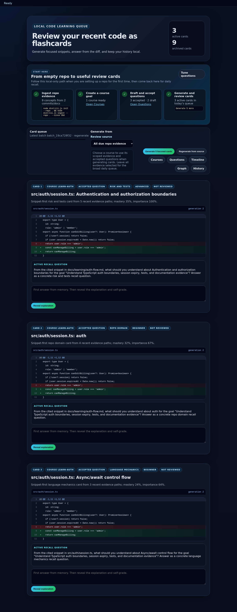
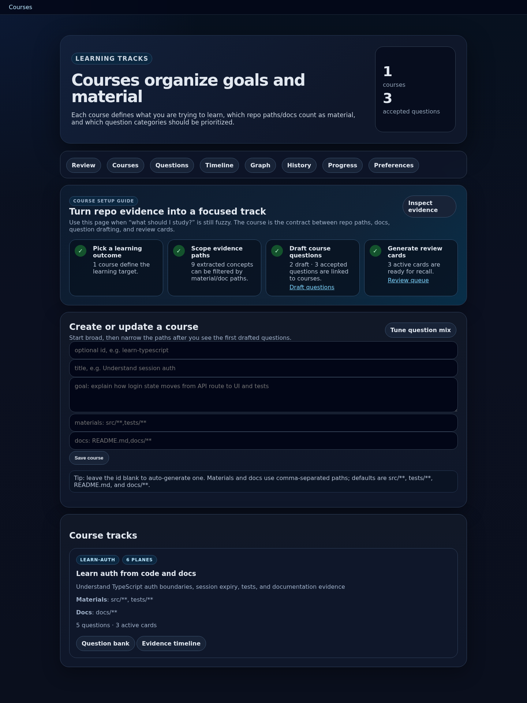
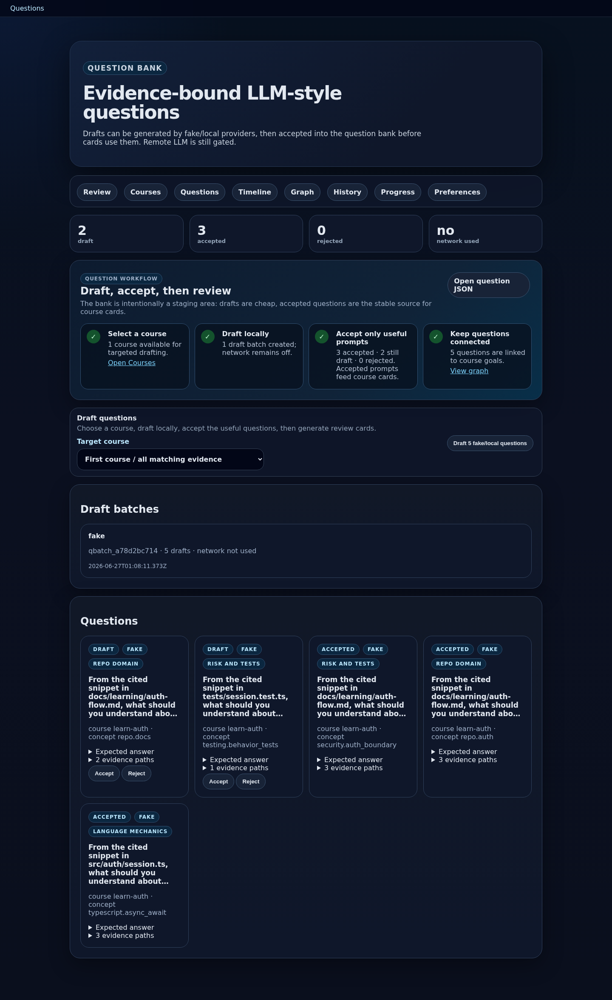
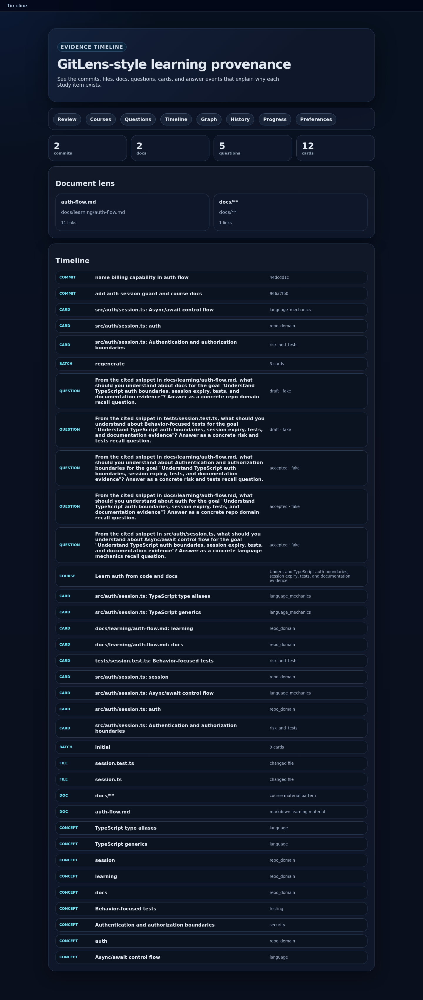
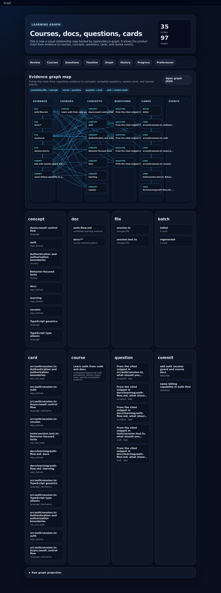
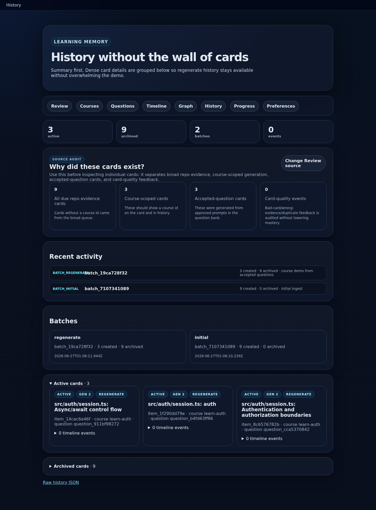
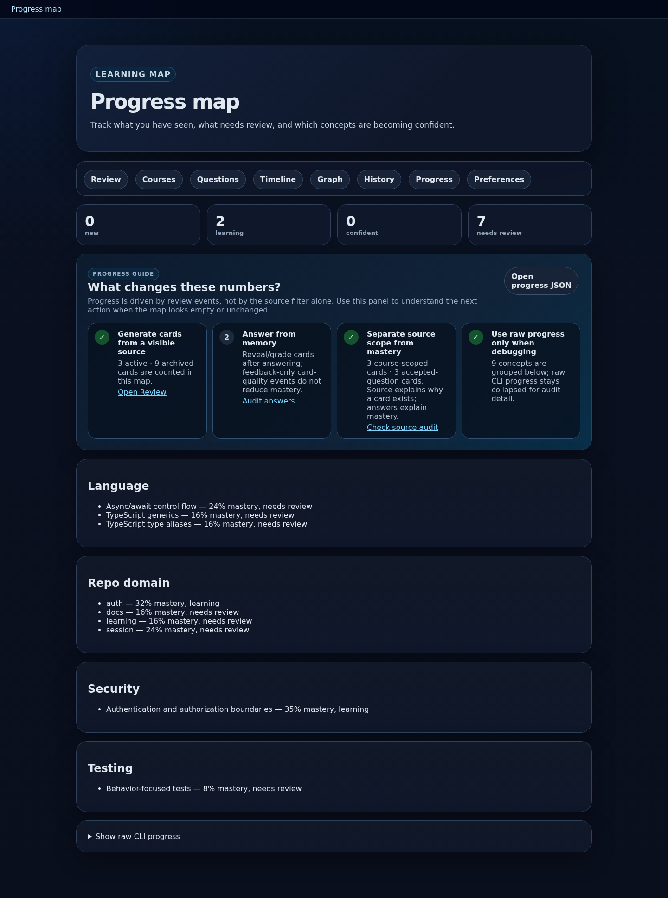
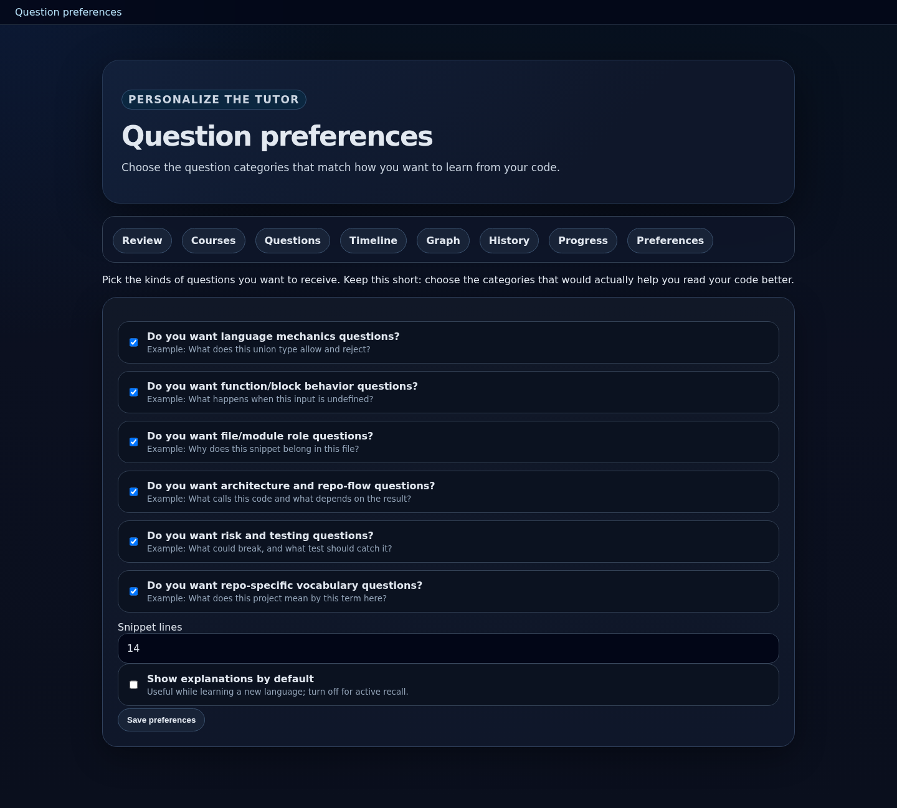

# Next best improvements for MergeLearn Tutor

This packet describes the current platform, frames the most important open product questions, and recommends what to implement, modify, pivot, or remove next.

It is grounded in:

- Current local branch: `autonomous-platform-polish`
- Fresh screenshots in `screenshots/`
- Current local browser app at `http://127.0.0.1:4197`
- Repo docs/source listed in `01-source-packet.md`
- External research sources listed in `01-source-packet.md`

## Executive recommendation

Do not add more pages first. The app already has enough surface area. The next best move is to make the current workflow feel like one coherent learning product:

1. Replace “Courses” as the only targeting abstraction with a broader `Learning Plan` model.
2. Add an explicit `Card Quality Gate` before cards enter the review queue.
3. Add source/repo targeting as a first-class setup step: repo, language, paths, docs, recency, and question mix.
4. Turn Progress from a passive report into `Next review plan` and `Why next` guidance.
5. Make the Graph/Timeline drill-down and filterable instead of primarily visual/raw.
6. Professionalize the UI shell with a real app layout, design tokens, empty states, and component hierarchy.

If only one product slice is implemented next, build this:

> A “Plan Builder” page or panel that combines learning goal, repo/path scope, language scope, question preferences, card-quality rules, and next actions into one clear setup flow.

This would reduce confusion across Courses, Questions, Preferences, and Review source selection.

## Current platform, in screenshots

### Review

Strengths:

- The core learning loop is visible: snippet, active recall question, answer box, reveal explanation.
- The `Start here` checklist gives a state-aware path from empty repo to review cards.
- Review source selector is a strong product idea: broad repo evidence vs course-specific review.
- Tags explain card provenance: course, accepted question, question plane, difficulty, review state.

Problems:

- It is still hard to know whether the generated question is good before investing attention.
- Cards are long and visually heavy. The page is more of an audit surface than a daily habit surface.
- Demo cards repeat the same snippet across several questions. This weakens trust in card quality.
- The Review source selector is useful but not enough: users also need recency, path, language, and difficulty controls.

Best next improvements:

- Add a compact `Today` mode that shows one card at a time.
- Add card quality indicators before review: evidence confidence, duplicate risk, answerability, specificity.
- Add `Why this card now?` as a small expandable panel on each card.
- Add keyboard shortcuts: reveal, knew it, partly, missed it, bad card.

### Courses

Strengths:

- Course setup guide makes targeting less abstract.
- Course form has useful defaults and examples.
- Course card shows goal, materials, docs, questions, and active cards.

Product question: are “courses” the right abstraction?

Mostly yes, but the name is probably too formal. The underlying abstraction is valuable: a named goal plus scoped evidence plus question preferences. However, users may think “course” means a full curriculum, while the current feature behaves more like a focused learning track.

Recommendation:

- Keep the data model, but make the UI concept `Learning Plans` or `Tracks`.
- A plan can contain one or more goals, source scopes, question types, and review rules.
- `Course` can remain an internal/CLI term for now, but the website should gradually move toward `Plan`, `Track`, or `Focus`.

Possible pivot:

- From “Create a course” to “Create a learning plan”.
- From “Course tracks” to “Learning tracks”.
- From “material paths/docs” to a guided source picker: code paths, tests, docs, languages, commits.

### Questions

Strengths:

- Draft/accept/reject staging is correct. It prevents every generated question from becoming a card.
- Network status is visible.
- Evidence paths and expected answer details are inspectable.
- Accepted questions feed review cards.

Problems:

- The accept/reject decision is underspecified. The user needs a rubric.
- Draft questions are visually similar and can be generic.
- There is no direct preview of “what card will this accepted question create?”
- There is no diversity control: question plane mix, source balance, duplicate checks, easy/hard balance.

Best next improvements:

- Add `Question quality checklist` to each draft:
  - specific to one concept
  - answerable from shown evidence
  - not duplicate of existing accepted question
  - asks for reasoning, not trivia
  - includes expected answer and source path
- Add `Preview card` for each question before accepting.
- Add `Improve draft` local transformation for weak questions.
- Add batch-level quality summary: duplicates, missing evidence, low specificity, repeated source.

Research grounding:

- Flashcard systems work best when they force active recall and use spacing/interleaving rather than passive review. The app already has active recall and self-grading, but it should now improve question specificity, feedback, spacing, and interleaving.
- Search results surfaced educational literature and summaries emphasizing spaced learning, retrieval practice, and interleaving as evidence-backed patterns.

### Timeline

Strengths:

- Makes docs and commits first-class evidence.
- Explains provenance and ordering.

Problems:

- Dense list, little filtering.
- It is not obvious how to answer “why did this exact card appear?” without jumping between pages.

Best next improvements:

- Add filters: type, course, path, commit, question status, card status.
- Add a card-centric trace view: commit/file/doc → concept → question → card → answer events.
- Add “copy evidence packet” for debugging or external review.

### Graph

Strengths:

- Visual graph map is a major improvement over grouped lists.
- Lanes communicate product pipeline: evidence → course/concept → question → card → event.
- Raw JSON remains available for trust and debugging.

Problems:

- Edges are already dense with only 35 nodes and 97 edges.
- There is no interactive filtering, search, node details, or focus mode.
- Events lane is empty in demo data, which makes the graph look incomplete.

Best next improvements:

- Add filter chips for node type and edge type.
- Add search/filter by path, course, concept, question, or card id.
- Add click-to-focus: selecting a node shows only ancestors/descendants and a detail panel.
- Consider a proven graph library only after the data interactions are clear. Avoid adding Cytoscape/vis-network before defining the user tasks.

Research grounding:

- Knowledge-graph education research emphasizes learning sequence, resource recommendation, and adaptive experience. The current graph should therefore support decisions: what to learn next, why this card exists, and where evidence came from, not just visualization.

### History

Strengths:

- Summary-first page prevents a wall of cards.
- Source audit clarifies broad evidence vs course-scoped vs accepted-question cards.
- Card-quality events are separated from mastery.

Problems:

- It is still mostly audit/debug information, not user-facing learning history.
- Could become very long across real usage.

Best next improvements:

- Add filters by source, course, status, event type, and date.
- Add “quality issues” view: bad cards, wrong evidence, duplicates.
- Add retention view: questions missed more than once, concepts improving, concepts stale.

### Progress

Strengths:

- Shows concept mastery and review status.
- Explains what changes the numbers.

Problems:

- It does not yet guide action.
- Mastery numbers may look precise even when based on sparse data.

Best next improvements:

- Rename or augment with `Plan`/`Next up`.
- Show what to review today and why.
- Add confidence bands or labels such as “low evidence”, “warming up”, “needs more answers”.
- Connect mastery to card scheduling and learning goals.

### Preferences

Strengths:

- Question planes are concrete and example-backed.
- Good place to customize learning style.

Problems:

- Preferences are isolated from Courses/Questions/Review source. Users may not realize they affect generation.
- No per-plan preferences.
- No examples of how a chosen preference changes actual cards.

Best next improvements:

- Fold preference selection into Plan Builder.
- Keep global defaults, but allow per-plan overrides.
- Add live examples: selecting a question plane previews one representative question.

## Product strategy: what should be implemented next?

### Priority 1: Plan Builder

Build a unified setup flow that creates a learning plan from:

- target repo
- learning goal
- paths and docs
- language/framework focus
- recency window
- question planes
- card quality threshold
- preferred cadence/session size

Why this matters:

- It answers the user’s core question: “What should I study and from where?”
- It reduces the need to bounce between Courses, Questions, Preferences, and Review.
- It turns the product from a collection of tools into a guided learning workflow.

Suggested implementation shape:

- New page or top-level panel: `/plan` or `/setup`.
- Existing Course model can back it initially.
- Add a “Generate plan preview” step before saving.
- Preview shows expected concepts, evidence sources, question mix, and likely cards.

### Priority 2: Card Quality Gate

Add quality metadata to draft questions and generated cards:

- answerability score
- evidence specificity score
- duplicate/similarity warning
- source diversity warning
- expected answer presence
- question-plane fit
- user-feedback history

Why this matters:

The current product’s biggest trust risk is not UI polish. It is whether users believe the questions are worth studying.

Suggested implementation shape:

- `src/core/cardQuality.ts`
- deterministic scoring first
- no remote LLM dependency
- show score/rubric on Questions and Review
- add tests with good/bad card fixtures

### Priority 3: Source Manager / Repo Picker

Clarify where data comes from.

Current answer:

- You initialize each target repo.
- State is stored under `.skilltrace/` in that repo.
- The session server points at one repo at a time.

Recommended product direction:

- Keep per-repo state as the default. This is privacy-preserving and transparent.
- Add a local workspace index for convenience:
  - list known repos
  - last ingest time
  - active plans
  - card counts
  - open session button
- Add source filters per plan:
  - paths
  - docs
  - language/framework
  - commit recency
  - authors maybe later

Do not silently plug into every git repo on the machine. Ask the user to select repos intentionally.

### Priority 4: One-card Review Mode

The Review page is currently powerful but dense. Add a mode optimized for actual daily use:

- one card at a time
- keyboard shortcuts
- minimal chrome
- progress indicator
- hide metadata until needed
- reveal explanation and self-grade
- “report card issue” affordance

Keep the current page as advanced/audit mode.

### Priority 5: Timeline and Graph filters

Add filters before adding a heavier graph library:

- type filters
- course filter
- search path/concept/question
- show ancestors/descendants for selected node
- edge-type toggles
- hide raw grouped panels by default once interactive graph exists

### Priority 6: Professional app shell and design system

Make the app look intentional, not just styled:

- persistent left sidebar or top app shell
- page title hierarchy
- reusable components: Hero, MetricCard, GuideStep, SourceBadge, EvidenceSnippet, QualityBadge, EmptyState, DetailDrawer
- design tokens in one place
- responsive layouts
- empty states with clear CTAs

A design scaffold is provided in `DESIGN_SYSTEM_SCAFFOLD.md`.

## Features to keep, modify, pivot, or remove

### Keep

- Local-first default.
- `.skilltrace/` per-repo state.
- Evidence-bound snippets and diffs.
- Answer-first active recall.
- Question draft/accept/reject staging.
- History preservation on regenerate.
- Raw JSON/debug transparency.

### Modify

- Rename or reframe Courses as Learning Plans/Tracks in the UI.
- Turn Preferences into global defaults plus per-plan overrides.
- Turn Progress into an actionable next-review plan.
- Turn Graph/Timeline into filterable trace tools.
- Add quality rubrics to Questions and Review.

### Pivot

- From “generate cards” to “build a learning plan, then generate review sessions”.
- From “graph as visualization” to “graph as explainability and next-step engine”.
- From “question bank as list” to “question quality pipeline”.

### Remove or de-emphasize

- De-emphasize raw JSON links in primary UI. Keep them in advanced/debug details.
- Avoid adding more top-level pages until current pages are consolidated.
- Avoid remote LLM features until local quality gates and privacy UX are excellent.
- Avoid a heavy graph library before filters/focus interactions are designed.

## Research questions to answer before large implementation

1. Should `Course` be renamed to `Plan`, `Track`, or `Focus`?
2. What is the minimum quality rubric that predicts a useful developer flashcard?
3. Should a plan be tied to exactly one repo, or can it span repos?
4. What source filters matter most: path, language, docs, recency, author, branch, file ownership?
5. What should be the daily habit loop: one-card mode, queue mode, or plan mode?
6. Should the graph become an interactive decision surface, or stay as an explainability/debug view?
7. What UI reference style best fits: Linear-like dense productivity, GitHub-like developer utility, or Duolingo/Anki-like learning habit?

## Suggested next implementation sequence

### Slice 1: Research/UI artifact only

- Add `DESIGN_SYSTEM.md` and component inventory.
- Add static mockups for Plan Builder and one-card review mode.
- No behavior changes.

### Slice 2: Plan Builder MVP

- Add `/plan` page backed by existing course state.
- Make it create/update one learning plan.
- Include source scope, question mix, and review source preview.
- Tests: server page, course persistence, generated plan preview.

### Slice 3: Quality Gate MVP

- Add deterministic question/card scoring.
- Show scores and warnings on Questions.
- Add tests for duplicate, missing evidence, broad/generic prompt, good prompt.

### Slice 4: One-card Review Mode

- Add `/review` or a toggle on `/`.
- Keyboard shortcuts.
- Smaller, faster card UI.
- Tests for answer/reveal/self-grade endpoints already exist; add browser HTML assertions.

### Slice 5: Graph/Timeline focus mode

- Add query params or client-side filters.
- Add node detail drawer.
- Add ancestor/descendant trace.

## Sources and evidence notes

This packet relies on local screenshots and current source inspection. External web search results support the general direction:

- Retrieval practice, spaced repetition, and interleaving are recurring evidence-backed learning patterns in search results including the JACR/ScienceDirect systematic review result on spaced learning/interleaving/retrieval practice.
- UX sources on progressive disclosure and dashboard design emphasize summary first, details on demand, and staged disclosure, which maps directly to the current issue of dense pages and many exposed controls.
- Knowledge-graph education sources emphasize semantic relationships, learning sequences, recommendations, and adaptive learning. This argues for using the graph to guide what to study next, not only to display nodes.

See `01-source-packet.md` for URLs and local source paths.
