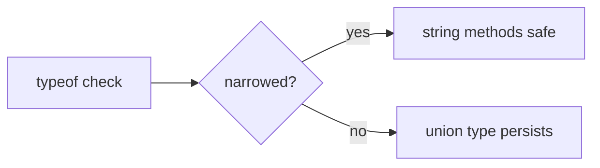

# Authoring MergeLearn cards with a coding agent

You (the coding agent) are the AUTHOR. The tutor owns provenance and gating: it
re-fetches every cited snippet from disk (your snippet text is never trusted),
runs deterministic structure + tag-graph checks, and stages only cards that
pass. Your job is to pick strong targets and write cards that genuinely teach.

## The handshake (two commands)

1. `mergelearn context --goal "<what to author>" [--repo <path>] [--target-set <id>]`
   Emits an AuthoringContext JSON: existing sets, existing tags (the learning
   graph), and the folder tree. Read it first so you REUSE tags/folders instead
   of inventing synonyms. Blind tagging fragments the graph.

2. `mergelearn import --file <patch.json> [--agent <name>]`
   Applies your AgentSetPatch. Both gates (tag-graph + card structure) must pass
   or NOTHING is written. Cards flagged `needs_review` are reported with reasons.

Verify the CLI is wired: `mergelearn --help` lists both commands. `mergelearn
serve` opens the local review GUI (prints a URL, blocks until Ctrl+C; open the
URL yourself, it does not auto-launch a browser).

## The single rule that determines provenance quality

If a card cites repo code, CITE LINE NUMBERS EXACTLY. The tutor freezes whatever
`startLine`-`endLine` you cite and pins it to the commit. Off-by-one ranges make
the card ask about code X while showing code Y, and with no oracle that mismatch
ships silently. Open the file, count the lines, verify the range. Conceptual
Conceptual cards (no repo) simply omit `sourceRefs` — that is fully supported.

## AgentSetPatch schema (what `--file` expects)

One JSON object per import. `tagPatch.add` proposes NEW tags (referenced by
`localId`); `tagPatch.reuse` lists existing tag ids you are reusing. `order`
must cover exactly the cards in this patch (by `localId`).

```json
{
  "version": 1,
  "set": { "title": "TypeScript narrowing", "folderPath": "typescript/types", "tagIds": [] },
  "tagPatch": {
    "reuse": ["tag_typescript"],
    "add": [{ "localId": "narrowing", "label": "narrowing", "kind": "topic", "parentIds": ["tag_typescript"] }]
  },
  "order": ["c1"],
  "cards": [
    {
      "localId": "c1",
      "tagRefs": ["tag_typescript", "narrowing"],
      "folderPath": "typescript/types",
      "front": {
        "prompt": "Why does `typeof x === 'string'` narrow x inside the block, and what breaks it?",
        "contextMarkdown": "Optional setup shown WITH the question (markdown, code fences OK)."
      },
      "back": {
        "shortAnswer": "One or two sentences: the direct answer, first thing shown on reveal.",
        "explanationMarkdown": "The teaching payload — see depth rules below. Full markdown.",
        "examples": [{ "label": "Widening pitfall", "language": "typescript", "code": "let x = cond ? 'a' : 1;", "note": "x: string | number" }],
        "commonMistakes": ["Assuming a narrowed type survives across an await/callback boundary."]
      },
      "sourceRefs": [{ "repoId": "<from context>", "path": "src/x.ts", "startLine": 6, "endLine": 8 }]
    }
  ]
}
```

Field notes: `front.prompt` must end in `?` and must NOT contain the
`shortAnswer` verbatim (anti-trivia gate). `shortAnswer` and
`explanationMarkdown` are both required and non-empty. `examples[].code` is
illustrative only — it is NOT provenance and is never frozen. Only `sourceRefs`
are re-read from disk.

## Write explanations that TEACH (the biggest quality lever)

`shortAnswer` is the quick check. `explanationMarkdown` is where the learning
happens — treat it as a mini-lesson, not a caption. A one-line explanation
wastes the card. Aim for 4-10 sentences (more when the topic warrants it) and
cover, in this rough order:

1. **The direct mechanism** — why the answer is what it is, step by step.
2. **The mental model** — the underlying principle the learner should
   internalize, phrased so it transfers to sibling problems.
3. **Why it matters / when it bites** — the real consequence, edge cases, the
   failure mode this knowledge prevents.
4. **Connections** — related concepts, contrasts ("unlike X, this…"), and where
   this fits the larger system. Link outward so the card seeds a web, not a fact.

Use full markdown: headings, lists, **bold** for the key term, and fenced code
blocks (```` ```ts ````) for any code — the renderer shows them as real code
blocks. Put runnable illustrations in `examples[]` and gotchas in
`commonMistakes[]` rather than cramming everything into one paragraph.

### Diagrams: mermaid is supported

When a flow, hierarchy, state machine, or sequence would explain faster than
prose, embed a mermaid diagram with a ```` ```mermaid ```` fence inside
`explanationMarkdown`. The GUI renders it as an SVG (raw diagram text shows as a
fallback if the diagram engine can't load). Example of the fence to emit:

````markdown

````

Reach for a diagram for control flow, call graphs, data/state transitions, and
type relationships. Keep them small and legible — 3-8 nodes usually beats a
sprawling graph.

## What the tutor rejects (deterministic gates — don't trip them)

- Empty `set.title`, `prompt`, `shortAnswer`, or `explanationMarkdown`.
- `prompt` that contains the `shortAnswer` verbatim → `answer_leak` (anti-trivia).
- Duplicate card `localId`, an `order` that misses a card or lists an unknown/
  duplicate one, or a `tagRef` that resolves to neither an existing tag id nor a
  `tagPatch.add` localId.
- A cited `sourceRef` whose file/range can't be resolved on disk → the card is
  imported as `needs_review`, not silently trusted.

## Pitfalls

- Off-by-one line ranges are the #1 provenance defect. Re-read and count.
- One concept per card. If a range needs two questions, author two cards.
- REUSE tags from the context handshake; don't invent `auth`/`authentication`
  synonyms — it fragments the learning graph.
- Don't stuff the answer into the prompt to "help" — the anti-trivia gate
  rejects it, and it defeats retrieval practice.
- A thin `explanationMarkdown` passes the (non-empty) gate but fails the learner.
  Depth is on you; the gate won't catch shallowness.
