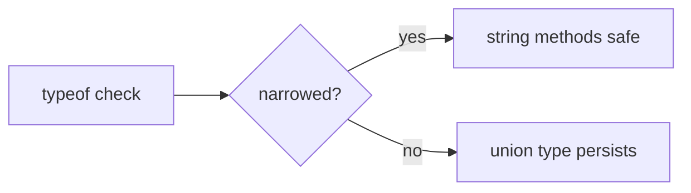

# Authoring MergeLearn cards with a coding agent

You (the coding agent) are the AUTHOR. The tutor owns provenance and gating: it
re-fetches every cited snippet from disk (your snippet text is never trusted),
runs deterministic structure + tag-graph checks, and stages only cards that
pass. Your job is to pick strong targets and write cards that genuinely teach.

## The handshake (two commands)

1. `mergelearn context --goal "<what to author>" [--repo <path>] [--target-set <id>]`
   Emits an AuthoringContext JSON: existing sets, existing tags (the learning
   graph), and the folder tree. Read it first so you REUSE tags/folders instead
   of inventing synonyms. Blind tagging fragments the graph.

2. `mergelearn import --file <patch.json> [--agent <name>]`
   Applies your AgentSetPatch. Both gates (tag-graph + card structure) must pass
   or NOTHING is written. Cards flagged `needs_review` are reported with reasons.

Verify the CLI is wired: `mergelearn --help` lists both commands. `mergelearn
serve` opens the local review GUI (prints a URL, blocks until Ctrl+C; open the
URL yourself, it does not auto-launch a browser).

## The single rule that determines provenance quality

If a card cites repo code, CITE LINE NUMBERS EXACTLY. The tutor freezes whatever
`startLine`-`endLine` you cite and pins it to the commit. Off-by-one ranges make
the card ask about code X while showing code Y, and with no oracle that mismatch
ships silently. Open the file, count the lines, verify the range. Conceptual
Conceptual cards (no repo) simply omit `sourceRefs` — that is fully supported.

## AgentSetPatch schema (what `--file` expects)

One JSON object per import. `tagPatch.add` proposes NEW tags (referenced by
`localId`); `tagPatch.reuse` lists existing tag ids you are reusing. `order`
must cover exactly the cards in this patch (by `localId`).

```json
{
  "version": 1,
  "set": {
    "title": "TypeScript narrowing", "folderPath": "typescript/types", "tagIds": [],
    "objective": "Predict when a typeof guard narrows and what breaks it",
    "lessonKind": "general", "estimatedMinutes": 8
  },
  "tagPatch": {
    "reuse": ["tag_typescript"],
    "add": [{ "localId": "narrowing", "label": "narrowing", "kind": "topic", "parentIds": ["tag_typescript"] }]
  },
  "order": ["c1"],
  "cards": [
    {
      "localId": "c1",
      "tagRefs": ["tag_typescript", "narrowing"],
      "folderPath": "typescript/types",
      "front": {
        "prompt": "Why does `typeof x === 'string'` narrow x inside the block, and what breaks it?",
        "contextMarkdown": "Optional setup shown WITH the question (markdown, code fences OK)."
      },
      "back": {
        "shortAnswer": "One or two sentences: the direct answer, first thing shown on reveal.",
        "explanationMarkdown": "The teaching payload — see depth rules below. Full markdown.",
        "examples": [{ "label": "Widening pitfall", "language": "typescript", "code": "let x = cond ? 'a' : 1;", "note": "x: string | number" }],
        "commonMistakes": ["Assuming a narrowed type survives across an await/callback boundary."]
      },
      "altitude": "function",
      "interaction": {
        "type": "choice",
        "options": [
          { "id": "a", "text": "The narrowing persists after the await", "feedback": "No — the await boundary discards the narrowed type; it widens back to the union." },
          { "id": "b", "text": "The type widens back to the union", "feedback": "Correct — control left and re-entered, so the guard no longer holds." }
        ],
        "correctOptionIds": ["b"]
      },
      "sourceRefs": [{ "repoId": "<from context>", "path": "src/x.ts", "startLine": 6, "endLine": 8 }]
    }
  ]
}
```

Field notes: `front.prompt` must end in `?` and must NOT contain the
`shortAnswer` verbatim (anti-trivia gate). `shortAnswer` and
`explanationMarkdown` are both required and non-empty. `examples[].code` is
illustrative only — it is NOT provenance and is never frozen. Only `sourceRefs`
are re-read from disk.

## A set is a lesson: give it an objective and interactions

A set is not a loose pile of facts — it is one lesson with one **objective** and
6-10 ordered activities that build toward it. Author the whole lesson, not
isolated cards. Set-level fields:

- `objective` — one observable capability the learner earns ("predict when `?`
  returns early", not "understand errors"). One objective per set.
- `lessonKind` — `general` (evergreen language/tooling/engineering knowledge, no
  repo), `repository` (this codebase's architecture, flows, conventions; anchor
  with `sourceRefs`), or `bridge` (a general concept AS USED in this repo —
  carry both the concept tag and repo `sourceRefs`). Reuse general lessons
  across repos instead of re-teaching the same concept per codebase.
- `estimatedMinutes`, optional `prerequisiteTagIds` (existing tag ids the learner
  should know first).

Every card carries an `interaction` that makes the learner ACT before the answer
is revealed. The reveal is feedback on their attempt, never the first thing they
read. Three types:

- `{ "type": "self_response", "placeholder": "..." }` — learner types a short
  answer, then self-grades against `shortAnswer`. Use for "explain/why" prompts.
- `{ "type": "choice", "options": [{id,text,feedback}...], "correctOptionIds": [...] }`
  — graded deterministically in the browser (no model at runtime). Use for
  output prediction, command choice, bug classification, options/tradeoffs.
  One correct id → single-select; several → multi-select.
- `{ "type": "parsons", "blocks": [{id,code,label?}...], "correctOrder": [ids...], "language?": "ts" }`
  — learner reorders shuffled code blocks; graded by exact order in the browser.
  Use for sequence-critical procedures: a function body, an algorithm, a setup
  sequence, an async/await flow. `correctOrder` must list every block id once.
- `{ "type": "flashcard" }` (or omit `interaction`) — legacy reveal-then-self-
  grade. Use ONLY for pure recall where no attempt is meaningful.

A good lesson mixes at least one `self_response` and one `choice`, and ends with
a harder transfer/application card. `altitude` (`line|function|module|service|
system`) tags the abstraction level so the learner can climb a concept from
syntax to architecture — set it per card when it varies.

### Writing choices that teach

Wrong options must be plausible misconceptions, not filler. EVERY option needs
`feedback` — for the right one, confirm WHY; for wrong ones, name the specific
mistake. That per-option feedback is the whole point: it turns a click into a
correction. For an options/tradeoffs card, present the options and ask the
learner to COMMIT to one under stated constraints, then let the feedback reveal
the tradeoff — don't hand them the tradeoff before they choose.

### Writing a Parsons card that grades cleanly

Grading is EXACT ORDER: the learner's sequence must equal `correctOrder`
position-for-position. The one failure mode is **ambiguity** — blocks with no
dependency between them have more than one valid order, so a learner who is
right gets marked wrong. Author against it:

- **Pick code where order is forced by dependency.** Each block should depend
  on a previous one: a variable used after it's declared, a guard before the
  code it protects, an `await` whose result the next line consumes, an
  algorithm whose steps only work in sequence. If two blocks could swap with no
  behavior change (two independent `const`s, two unrelated imports), merge them
  into one block or pick different code.
- **One logical unit per block, 3-8 blocks.** Split at meaningful boundaries
  (a guard, a loop header, a return), not mid-expression. A closing `}` on its
  own line is fine when indentation/scope makes its position unambiguous.
- **Use `label` as a subgoal cue, not the answer.** "Guard the input", "Base
  case", "Recurse" help the learner reason about structure. Never label a block
  with its position ("Step 1").
- **Keep `correctOrder` an exact permutation of the block ids** — every id once,
  no extras, no omissions. The tutor hard-rejects anything else.
- No distractor blocks in this version: every block belongs in the answer. The
  explanation should say WHY the order matters (data/control flow), not just
  restate the finished code.

## Write explanations that TEACH (the biggest quality lever)

`explanationMarkdown` is FEEDBACK the learner reads AFTER attempting — not a
lecture they read first. Lead with the one thing that resolves their attempt,
then let them opt into depth (the GUI hides the full explanation behind a
"Show full explanation" fold). So: put the direct mechanism in the first
sentence or two, and keep the rest tight. Prefer a short, layered answer over a
wall of prose — if it needs a second concept, that is usually a second card.
Cover, in this rough order (later points are the opt-in depth):

1. **The direct mechanism** — why the answer is what it is, step by step.
2. **The mental model** — the underlying principle the learner should
   internalize, phrased so it transfers to sibling problems.
3. **Why it matters / when it bites** — the real consequence, edge cases, the
   failure mode this knowledge prevents.
4. **Connections** — related concepts, contrasts ("unlike X, this…"), and where
   this fits the larger system. Link outward so the card seeds a web, not a fact.

Use full markdown: headings, lists, **bold** for the key term, and fenced code
blocks (```` ```ts ````) for any code — the renderer shows them as real code
blocks. Put runnable illustrations in `examples[]` and gotchas in
`commonMistakes[]` rather than cramming everything into one paragraph.

### Diagrams: mermaid is supported

When a flow, hierarchy, state machine, or sequence would explain faster than
prose, embed a mermaid diagram with a ```` ```mermaid ```` fence inside
`explanationMarkdown`. The GUI renders it as an SVG (raw diagram text shows as a
fallback if the diagram engine can't load). Example of the fence to emit:

````markdown

````

Reach for a diagram for control flow, call graphs, data/state transitions, and
type relationships. Keep them small and legible — 3-8 nodes usually beats a
sprawling graph.

## What the tutor rejects (deterministic gates — don't trip them)

- Empty `set.title`, `prompt`, `shortAnswer`, or `explanationMarkdown`.
- `prompt` that contains the `shortAnswer` verbatim → `answer_leak` (anti-trivia).
- Duplicate card `localId`, an `order` that misses a card or lists an unknown/
  duplicate one, or a `tagRef` that resolves to neither an existing tag id nor a
  `tagPatch.add` localId.
- A cited `sourceRef` whose file/range can't be resolved on disk → the card is
  imported as `needs_review`, not silently trusted.
- A malformed `interaction`: unknown `type`; a `choice` with fewer than 2
  options, a duplicate option `id`, an empty `correctOptionIds`, a `correctOptionId`
  matching no option, or any option missing `feedback`. A `set.lessonKind` that
  is not `general|repository|bridge`.
- A malformed `parsons`: fewer than 2 blocks, an empty or duplicate block `id`,
  an empty block `code`, or a `correctOrder` that isn't an exact permutation of
  the block ids (unknown id, duplicate, or a missing block).

Note what is NOT gated: lesson size (6-10), the self_response/choice mix, and
explanation length are authoring guidance, not hard rejects. The gate protects
structure; teaching quality is on you.

## Pitfalls

- Off-by-one line ranges are the #1 provenance defect. Re-read and count.
- One concept per card. If a range needs two questions, author two cards.
- REUSE tags from the context handshake; don't invent `auth`/`authentication`
  synonyms — it fragments the learning graph.
- Don't stuff the answer into the prompt to "help" — the anti-trivia gate
  rejects it, and it defeats retrieval practice.
- A thin `explanationMarkdown` passes the (non-empty) gate but fails the learner.
  Depth is on you; the gate won't catch shallowness. (But an over-long one buries
  the mechanism — lead tight, defer depth to the fold.)
- A lesson of only `choice` cards drills recognition, not recall. Mix in
  `self_response` and end with a transfer card that applies the idea somewhere new.
- A `parsons` card whose blocks have no dependency between them has multiple
  valid orders but grades on ONE — a correct learner gets marked wrong. Only use
  `parsons` when sequence is forced by data/control flow; otherwise use `choice`.
- Don't front-load the answer in the prompt or `contextMarkdown` — the learner
  must attempt first for the reveal to teach. The explanation is the payoff, not
  the setup.
- Trivial distractors waste a `choice`. If the wrong options are obviously wrong,
  the learner pattern-matches instead of reasoning. Make each a real misconception.
